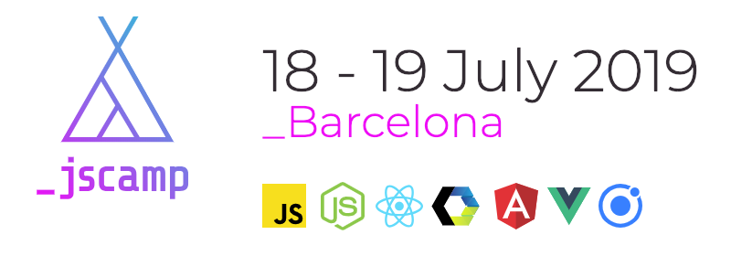
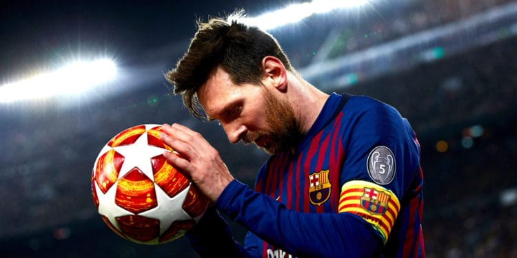

# Cloudinary's Guess the Transformation Challenge: JSCamp Barcelona 2019

### This challenge involves guessing a Cloudinary transformation URL that produces a given target image from one \(or more\) given source image\(s\).

##                                               Source Images:

#### Source image \#1: [https://res.cloudinary.com/demo/image/upload/messi-2.jpg](https://res.cloudinary.com/demo/image/upload/messi-2.jpg)

\*\*\*\*

\*\*\*\*

**Source image \#2:** [**https://res.cloudinary.com/demo/image/upload/soccer-player-11.png**](https://res.cloudinary.com/demo/image/upload/soccer-player-11.png)\*\*\*\*

##                                           ****Warm-Up Example:

#### [**https://res.cloudinary.com/demo/image/upload/e\_tint:20:red/l\_soccer-player-11,g\_west,h\_150,w\_150,e\_replace\_color:red/l\_text:Arial\_40\_bold:Campe%C3%B3n,g\_north\_west,co\_white/messi-2.jpg**](https://res.cloudinary.com/demo/image/upload/e_tint:20:red/l_soccer-player-11,g_west,h_150,w_150,e_replace_color:red/l_text:Arial_40_bold:Campe%C3%B3n,g_north_west,co_white/messi-2.jpg)\*\*\*\*

### Image Transformations Docs:

### [https://cloudinary.com/documentation/image\_transformations](https://cloudinary.com/documentation/image_transformations)

### Cookbook Recipes \(optional\):

### [https://cloudinary.com/cookbook](https://cloudinary.com/cookbook)

